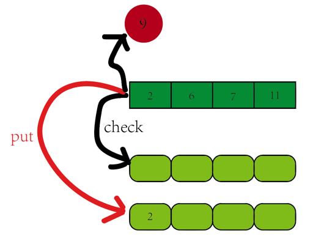

## 关键点
+ 该题的关键点之一是map的使用。

## 出现的错误
+ if target - nums[i] in dic: IndexError: list index out of range 
原因：for i in nums 里的i并不是range(len(nums))里index的位置，因此不能作为nums的索引。
+ dic[target - nums[i]] = i 应该是 dic[nums[i]] = i。 
因为要检查diff值在dict中是否存在，如果不存在，就将数组中现存的值存入，而不是将diff值存入数组，因为diff值是一个猜测出来的值，在后续的结果中是否存在并不确定。
+ 在for中return后，后面跳出循环的return要怎么处理？ 
本题的处理方法是：什么也不加直接一个return。
+增加边界条件的处理，如果nums小于2个元素要如何处理？

