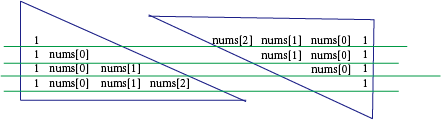

## 思考
利用了一个技巧，将一个矩阵划分为两个三角形，以每个位置的元素作为分界线划分，将这两个三角形按行相乘。

## 关键
第2个三角形是按照倒着的方式来进行的填充的
+ 创建第一个三角形的时候，需要使用 append 向数组里添加元素，因为数组开始是空的
+ 在第二个三角形的时候，才开始运算

一个提升运算效率的方法：在第一遍存入数据后，再第二遍中，尽量把存储和运算合并执行，这样能减少一遍遍历。

## 涉及的情况


## 答案
```
class Solution(object):
    def productExceptSelf(self, nums):
        """
        :type nums: List[int]
        :rtype: List[int]
        """
        
        output = []
        
        p=1
        for i in range(len(nums)):
            output.append(p)
            p *= nums[i]
            
        p=1
        for i in range(len(nums)-1, -1, -1):
            output[i] *= p
            p *= nums[i]
            
        return output
```
