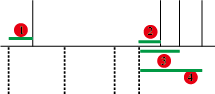

## 思路
给出会议室的开会时间间隔，找出需要的最少数量的会议室。
+ 有重合的时段，不能使用相同的会议室
+ 无重合的时段，可以使用相同的会议室
因此，问题变成有几个重合时段的间隔，最终也就是有几个会议室

## 关键
利用的技巧是，
+ 把 start 开始时段做单独排序，从小到大
+ 把 end 结束时段做单独排序，从小到大
所有 end 减去 start 差值大于0的个数，就是有重叠间隔，也就是最终的值。减过一次的 end 不可用了，只能使用一次。


## 几种情况
同 56 题
+ 

## 答案
```
class Solution(object):
    def minMeetingRooms(self, intervals):
        """
        :type intervals: List[List[int]]
        :rtype: int
        """
        
        if not intervals:
            return 0
        
        start_timing = sorted([i[0] for i in intervals])
        end_timing = sorted([i[1] for i in intervals])
        
        start_pointer = 0
        end_pointer = 0
        
        L = len(intervals)
        using_rooms = 0
        
        while start_pointer < L:
            if start_timing[start_pointer] >= end_timing[end_pointer]:
                using_rooms -= 1
                end_pointer += 1
            
            using_rooms += 1
            start_pointer += 1
        
        return using_rooms
```
