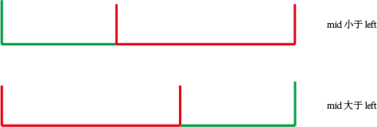

## 思路
判断一个元素在有序数组中的哪一个部分？

## 关键
+ 左右指针是和 mid 进行比较，而不是左右指针自己比较
+ 对可能是浮点数的情况，使用整除操作 // 进行取整
+ 检查过一遍的逻辑，后续的分段检查中也同样适用，直到能找到最适合目标值为止，否则就是在数组中找不到，返回-1.
+ 在判断 left 和 right 指针的时候，需要允许 left == right 的情况出现。

## 涉及的情况




## 答案
```
class Solution(object):
    def search(self, nums, target):
        """
        :type nums: List[int]
        :type target: int
        :rtype: int
        """
        
        left, right = 0, len(nums)-1
        
        while left <= right:
            mid = (left + right) // 2
            
            if nums[mid] == target:
                return mid
            
            if nums[left] <= nums[mid]:
                if nums[left] <= target and target <= nums[mid]:
                    right = mid - 1
                else:
                    left = mid + 1
            else:
                if nums[mid] <= target and target <= nums[right]:
                    left = mid + 1
                else:
                    right = mid - 1
        
        return -1
```
