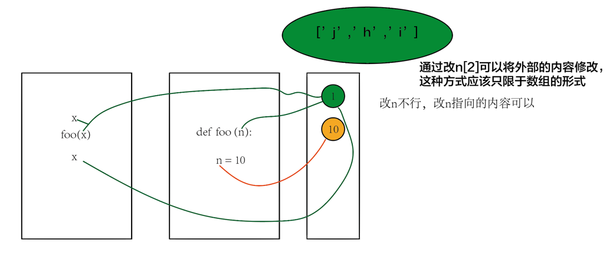

## 目标
对字符串中对每个字母进行反转

## 思路
通过局部变量改变内容

## 为什么不能用s[::-1]的方式？
+ python的传参是怎么样的？<br>
  **passed by assignment**
+ 所以局部参数不能传出内容

## Hint
```
def foo(n):
    n = 10 
    
x = 1
print(x)
foo(x)
print(x)
```
 **passed by assignment** 的方式会创建一个指向 1 这个对象的引用。


## Python: 如何在调用函数时，传递一个参数？
1. 使用 return 语句
2. 使用全局变量
3. 传入可变对象，数组和字典就属于可变对象。int不算。
4. 传入类对象

## 答案
```
class Solution(object):
    def reverseString(self, s):
        """
        :type s: List[str]
        :rtype: None Do not return anything, modify s in-place instead.
        """
        
        for i in xrange(len(s)):
            s[i], s[len(s)-1-i] = s[len(s)-1-i], s[i]
            
            if (i == len(s)-1-i) or (abs(i - (len(s) -1 -i)) == 1):
                break
        
```
