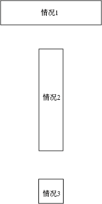

## 思路
分析旋转过程中可能出现的几种情况，逐个遍历。

## 关键
汇总结尾的情况：
1. top == bottom, 从左到右的横条
2. left == right, 从顶到底的竖条
3. top == bottom && left == right, 最后只剩一个元素

## 涉及的情况

## 答案
1. 答案1
```
class Solution(object):
    def spiralOrder(self, matrix):
        """
        :type matrix: List[List[int]]
        :rtype: List[int]
        """
        
        if not matrix:
            return []
        
        top, left = 0, 0
        bot, right = len(matrix)-1, len(matrix[0])-1
        res = []
        
        while (top < bot) and (left < right):
            
            for i in range(left, right):
                res.append(matrix[top][i])
            for i in range(top,bot):
                res.append(matrix[i][right])
            for i in range(right, left, -1):
                res.append(matrix[bot][i])
            for i in range(bot, top, -1):
                res.append(matrix[i][left])
                
            left += 1
            right -= 1
            top += 1
            bot -= 1
                
        if top == bot:
            for i in range(left, right+1):
                res.append(matrix[top][i])
        elif left == right:
            for i in range(top, bot+1):
                res.append(matrix[i][left])

            
        return res
            
        
```

2. 答案2
```
class Solution(object):
    def spiralOrder(self, matrix):
        ret = []
        while matrix:
            ret += matrix.pop(0)
            if matrix and matrix[0]:
                for row in matrix:
                    ret.append(row.pop())
            if matrix:
                ret += matrix.pop()[::-1]
            if matrix and matrix[0]:
                for row in matrix[::-1]:
                    ret.append(row.pop(0))
        return ret
```
