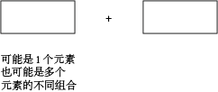

## 思路
从最基础的循环思路进行改进，首先是改进 1 个循环，增加预置数组，其次是改进 2 个循环，最后是改进 3 个循环，最后让时间复杂度能最高的利用，只遍历一遍。

## 关键
1. 一个关键的 tips 是新建一个数组连续位置上的累加预置数组，每一位内容是该位之前所有元素之和。

每一位上的和，有如下关系：
```
p(j) = n0 + n1 + n2 + ... + n(i-1) + n(i) + n(j)
p(i-1) = n0 + n1 + n2 + ... + n(i-1)
```

```
sum(i,j) = p(j) - p(i-1) = n(i) + n(j)
```

2. 在 board 中存的是数组中每种情况的列举，并计数。
## 涉及的情况
1. 1作为temp_sum，只记录了一次,为什么会多次被调用还可行？
temp_sum 记录了目前最长的元素和，k 表示目标，两者相见，正好得到了当前元素可实现 k 的距离，此时，正好也是1可以满足。因此，加的是1. 如果是2的话， 就是前面这一段中可得出2的可能性有n个，所以汲取n

2. 



## 答案
```
class Solution(object):
    def subarraySum(self, nums, k):
        """
        :type nums: List[int]
        :type k: int
        :rtype: int
        """
        
        #p = []
        board = {}
        board[0] = 1
        counts = 0
        temp_sum  = 0
        
        for i in xrange(1,len(nums)+1):
            temp_sum += nums[i-1]
            #p.append(temp_sum)
            
            if temp_sum - k in board:
                counts += board[temp_sum - k]
            
            if temp_sum not in board:
                board[temp_sum] = 1
            else:
                board[temp_sum] += 1
                
        return counts
```
