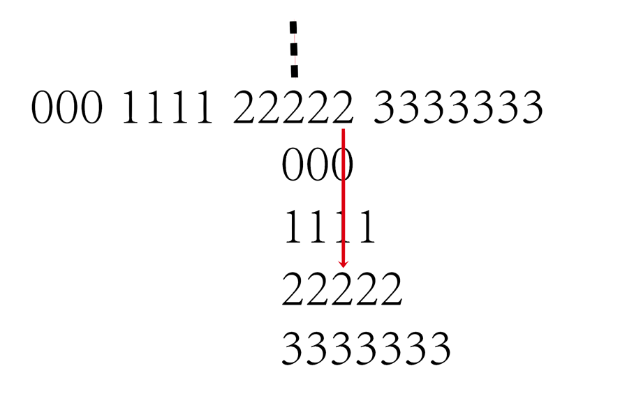

## 目标
+ 找出中位数

## 思路
+ 需要将number按照frequency展开来，
+ 然后计算总数
+ 求出总数一半的索引位置
+ 将索引指向的元素运算

## 知识点
+ @curFreq 表示什么？
+ + 变量名，如果不加的话，会认为这是一个列名，但是这列不存在，就会报错。
+ + 一个@是由用户自己声明的局部变量，，，而2个@@开头的是系统里面的全局变量
```
#代码示例
SET @old_log_state = @@global.general_log; # 定义一个old_log_state的变量，并把系统变量global.general_log的值赋给它
```
+ 不怕浪费空间，新元素每个位置都复制一份在表的后面
+ 中位数元素区的结尾落在有效区内，该有效区内是指过半之后再加元素本身序列长度。


## 答案
```
SELECT AVG(Number) AS median FROM (
  SELECT Number, Frequency, AccFreq, SumFreq FROM
  (SELECT    Number,
             Frequency, @curFreq := @curFreq + Frequency AS AccFreq
   FROM      Numbers n, (SELECT @curFreq := 0) r
   ORDER BY  Number) t1,
  (SELECT SUM(Frequency) SumFreq FROM Numbers) t2
) t
WHERE AccFreq BETWEEN SumFreq / 2 AND SumFreq / 2 + Frequency
```
