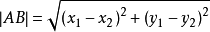

## 单词
+ coordinates 坐标
+ decimals 小数

## 内置函数
+ sqrt() 开根号。
+ power() n次方，power(10, 9),10的9次方。
+ exp() 以e为底n次方。
+ min() 数组中取值最小的那个。
+ round() 保留小数点后2位, round(x,2)。

## 逻辑符号
+ 不等于 mysql中用<>与!=都是可以的
+ and 表示两个条件必须都不同
+ or 表示两个至少有一个不同

本题中有一个维度坐标不同，就是另外一个点。因此，需要用or。

##Mysql如何组成笛卡尔积

#### 表格形式
重复的部分在后面。

|t1.x|t1.y|t2.x|t2.y|
|----|----|----|----|
|-1|-1|-1|-1|
|0|0|-1|-1|
|-1|-2|-1|-1|
|-1|-1|0|0|
|0|0|0|0|
|-1|-2|0|0|
|-1|-1|-1|-2|
|0|0|-1|-2|
|-1|-2|-1|-2|

## 距离公式

