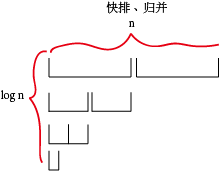
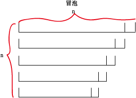
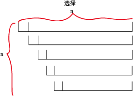
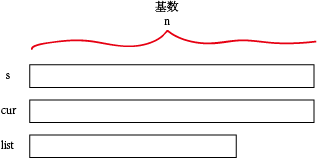

### 性能对比

|名称|平均时间复杂度|最好情况|最差情况|空间复杂度|代码实现|稳定性|
|---|---|---|---|---|---|---|
|归并排序|nlogn|nlogn|nlogn|看情况|✅|稳定|
|快速排序|nlogn|nlogn|n^2|logn|✅|不稳定|
|桶排序 radix|kn|已经是有序的|||✅|稳定|
|冒泡排序|n^2|**n**|n^2|1|✅|稳定|
|选择排序|n^2|n^2|n^2|1|✅|不稳定|
|插入排序|n^2|**n**|n^2|1|✅|稳定|
|堆排序|nlogn|nlogn|nlogn|1|✅|不稳定|

### 图示对比
快排/归并 

冒泡 

选择 

基数 

#### 快速排序最坏的情况什么时候出现？
需要看枢轴的选择策略。
1. **输入的枢轴是最大或者最小元素，最坏的情况就来了。** 此时需要对所有元素都进行排序操作。

    最左边或最右边的元素被选为枢轴时，在下面的前提下会发生最坏的情况：
    1. 数组已经是正序排过序的
    2. 数组已经是倒序排过序的
    3. 所有的元素都相同

2. 通过**树**的方式理解：

    快速排序的时间性能取决于快速排序**递归的深度**，可以用**递归树**来描述递归算法的执行情况。
    由于第一个关键字正好是待排序的序列中间值，因此递归树是平衡的，此时性能也比较好。

    最坏的情况下，正序或逆序的序列，因此递归树会是一个斜树，一面为空，一面特别长。

## 插入排序

## 堆排序
明确一个概念**完全二叉树**
+ 每个节点的左子节点为 2i
+ 每个节点的右子节点为 2i+1
+ 中间的间隔就是它的兄弟节点

